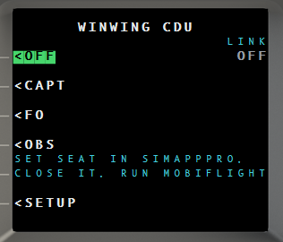

# Hardware control — MobiFlight & the MSFS WASM bridge

This folder is the simulator-side input path for **EasyCPDLC-Loaded**. It lets
cockpit hardware — a WinWing 737 CDU, a MobiFlight board, buttons and encoders —
drive the instrument on your desktop.

There is **no in-simulator 3D instrument**. The EasyCPDLC-Loaded window is the
display; this bridge only carries *keypresses in* and *status out*.

Everything here is **optional**. Both instruments work fine with the mouse and
keyboard alone. Install this only if you want physical controls.

> A prebuilt module is included — see [Install the bridge](#1-install-the-wasm-bridge).
> You do **not** need the MSFS SDK.

---

## Contents

1. [Install the WASM bridge](#1-install-the-wasm-bridge)
2. [Turn on hardware keys](#2-turn-on-hardware-keys)
3. [Verify it works](#3-verify-it-works)
4. [Bind the 737 CDU](#4-bind-the-737-cdu)
4b. [Mirror the screen to a WinWing CDU](#4b-mirror-the-screen-to-a-winwing-cdu)
5. [CDU key reference](#5-cdu-key-reference)
6. [Status outputs (annunciators)](#6-status-outputs-annunciators)
7. [GNS430 hardware (alternative)](#7-gns430-hardware-alternative)
8. [Run the panel as a bare screen](#8-run-the-panel-as-a-bare-screen)
9. [Troubleshooting](#9-troubleshooting)
10. [Rebuild the module from source](#10-rebuild-the-module-from-source-optional)

---

## What you need

| Component | Needed for | Notes |
|---|---|---|
| **MSFS 2024** | running the bridge | The bridge is a standalone WASM module. |
| **MobiFlight Connector** | sending button presses | Free. Reads/writes the `L:` variables below. |
| **EasyCPDLC-Loaded** | the display | The 737 CDU is the default instrument. |
| A MobiFlight board or WinWing 737 CDU | the buttons | Any device MobiFlight can see. |
| MSFS 2024 SDK | **rebuilding** only | Not needed — a built module ships here. |

### How input flows

```text
physical key -> MobiFlight -> L:EASYCPDLC_CDU_* -> WASM bridge
             -> SimConnect Client Data -> EasyCPDLC-Loaded CDU
```

Status flows back the same way so the board can light annunciators.

---

## 1. Install the WASM bridge

A **prebuilt, ready-to-drop package** is included in this repository at:

```text
EasyCPDLC/VNS430/MSFS2024Module/CommunityPackage/easycpdlc-vns430-bridge/
```

Copy that **whole `easycpdlc-vns430-bridge` folder** (not just the `.wasm`) into
your MSFS 2024 **Community** folder:

```text
Steam:            %APPDATA%\Microsoft Flight Simulator 2024\Packages\Community
Microsoft Store:  %LOCALAPPDATA%\Packages\Microsoft.Limitless_8wekyb3d8bbwe\LocalCache\Packages\Community
```

If neither path exists, open `UserCfg.opt` for MSFS 2024, read its
`InstalledPackagesPath` line, and use the `Community` folder beneath it.

When you are done it must look exactly like this:

```text
...\Community\easycpdlc-vns430-bridge\manifest.json
...\Community\easycpdlc-vns430-bridge\layout.json
...\Community\easycpdlc-vns430-bridge\modules\easycpdlc-vns430-bridge.wasm
```

Then **restart MSFS 2024** — the sim only scans the Community folder at startup.

> The folder and module keep the internal `vns430` name because that is the
> SimConnect/L-var protocol identity shared with the app. Renaming it stops the
> bridge from pairing.

---

## 2. Turn on hardware keys

Hardware input is gated by a switch in the app, so a stray L-var can never press
keys while you are flying by mouse.

In EasyCPDLC-Loaded, on the CDU:

```text
SETUP  ->  HW KEYS  (right-hand key 4)  ->  ON
```

Press the right-hand line-select key next to `HW KEYS` to toggle `OFF` -> `ON`.
The setting is remembered.

With `HW KEYS` **ON**, the `EASYCPDLC_CDU_*` / `EASYCPDLC_DCDU_*` inputs drive
the CDU. With it **OFF**, they are ignored (and the GNS430's own command set is
active instead — see [section 7](#7-gns430-hardware-alternative)).

---

## 3. Verify it works

1. Start **MSFS 2024** and load into any flight.
2. Start **EasyCPDLC-Loaded**.
3. Right-click the tray icon and read the status line:

   ```text
   MobiFlight module: connected
   ```

   That line is the quickest confirmation the bridge is loaded and paired. If it
   reads *not detected*, the module is not running — see
   [Troubleshooting](#9-troubleshooting).
4. For a deeper check, open MobiFlight Connector and watch
   `L:EASYCPDLC_VNS_MODULE_ALIVE`. It ticks to `1` about once a second while the
   module is loaded, and `L:EASYCPDLC_VNS_APP_CONNECTED` reads `1` once the app
   is reachable.

---

## 4. Bind the 737 CDU

Import the CDU profile:

```text
MobiFlight\EasyCPDLC-WinWing-737-CDU.mfproj
```

It covers the **twelve line-select keys** plus the **full Boeing 737NG keypad**:
`A`–`Z`, `0`–`9`, `SP` `DEL` `CLR` `/` `.` `+/-`, and the function keys
`INIT REF` `RTE` `CLB` `CRZ` `DES` `MENU` `LEGS` `DEP ARR` `HOLD` `PROG` `EXEC`
`N1 LIMIT` `FIX` `PREV PAGE` `NEXT PAGE` `BRT`.

Each key is one momentary `L:EASYCPDLC_CDU_*` input, so a **WinWing 737 CDU**
binds directly — exactly like a WinWing profile for any other aircraft.

### Steps

1. In MobiFlight Connector choose **File > Open** and select the `.mfproj`. Its
   rows appear on the **Input** tab.
2. Every row ships bound to a placeholder device so the profile imports cleanly
   on any machine:

   ```text
   Controller: EasyCPDLC VNS430 Template
   Serial:     EASYCPDLC-VNS430-TEMPLATE
   ```

   That placeholder matches no real hardware, so **every row shows as unassigned
   until you reassign it.** This is expected, not an error.
3. For each row, change the device to your connected board or WinWing CDU, then
   pick the pin/button that should fire it.
4. Leave the **command** side of each row alone — that is the private binding and
   is already correct.
5. Save the project.

---

## 4b. Mirror the screen to a WinWing CDU

The keys above send input *in*. This sends the **screen out**, so a physical WinWing
CDU shows exactly what the app shows.

MobiFlight hosts a websocket server on port `8320` with one endpoint per seat and
drives the panel over HID itself, so EasyCPDLC-Loaded simply publishes frames to it —
there is no fight over the USB device.

### Set it up

1. In **SimAppPro**, set the unit to `CAPTAIN`, `CO-PILOT`, or `OBSERVER`. Each seat
   enumerates as its own USB device, so this is what decides which endpoint receives
   the frames.
2. **Exit SimAppPro completely.** MobiFlight and SimAppPro cannot both hold a CDU.
3. Start **MobiFlight Connector** (it must be running — the port only exists while it
   is up).
4. On the CDU go to `SETUP` → `<WINWING`. Pick the seat you set in step 1:

   ```text
   WINWING CDU              LINK
   <OFF                      OFF
   <CAPT
   <FO
   <OBS
   ```

   The active choice is shown highlighted.

   

### It resets every session — on purpose

The seat is **never saved**. Every launch starts at `OFF` and you pick a seat again.

That is deliberate: the app can never grab a CDU on startup that is already showing a
live aircraft display. Nothing is mirrored until you deliberately ask for it, each
session.

### Reading the LINK field

| LINK | Meaning |
|---|---|
| `OFF` | No seat selected; nothing is sent |
| `WAITING` | Seat selected but not connected — MobiFlight is closed, or no CDU is set to that seat |
| `SENDING` | Connected; frames are going out |

`WAITING → SENDING` is your confirmation it worked. Selecting a seat while MobiFlight
is closed is harmless: it retries every five seconds in the background and never
blocks the app.

### What is sent

The full screen every repaint — 336 cells (24 columns × 14 rows), as
`{"Target":"Display","Data":[…]}`, preceded once by `{"Target":"Font","Data":"Boeing"}`
to select the 737 typeface. Frames are coalesced, so a slow socket can never make the
app stutter.

---

## 5. CDU key reference

Every key is a momentary input: set the variable to `1` on press. The bridge
handles the release.

| Keys | L-var pattern | Example |
|---|---|---|
| Line-select, left | `L:EASYCPDLC_DCDU_LSK_L1` … `_L6` | `…LSK_L1` = L1 |
| Line-select, right | `L:EASYCPDLC_DCDU_LSK_R1` … `_R6` | `…LSK_R3` = R3 |
| Letters | `L:EASYCPDLC_CDU_A` … `_Z` | `…CDU_G` |
| Digits | `L:EASYCPDLC_CDU_0` … `_9` | `…CDU_7` |
| Symbols | `_SP` `_DEL` `_CLR` `_SLASH` `_DOT` `_PLUSMINUS` | `…CDU_CLR` |
| Pages | `_PREV_PAGE` `_NEXT_PAGE` | `…CDU_NEXT_PAGE` |
| Execute | `_EXEC` | `…CDU_EXEC` |
| Menu / nav | `_MENU` `_INIT_REF` `_RTE` `_LEGS` `_DEP_ARR` `_HOLD` `_PROG` `_FIX` `_CLB` `_CRZ` `_DES` | `…CDU_MENU` |
| Brightness | `_BRT_UP` `_BRT_DN` | `…CDU_BRT_UP` |

The keys that matter most in daily use are the twelve **LSKs**, **EXEC** (which
sends any armed transmit), **CLR**, **MENU**, and **PREV/NEXT PAGE** for
scrolling long messages such as a loadsheet.

---

## 6. Status outputs (annunciators)

Add MobiFlight *output* configs reading these to drive lamps or displays.

### CDU annunciator lamps

These mirror the four lamps down the sides of the on-screen CDU plus the EXEC
light, so a physical unit lights exactly when the software one does. Each reads
`1` while lit and `0` otherwise — bind them straight to an LED.

| Variable | Lamp | Lights when |
|---|---|---|
| `L:EASYCPDLC_CDU_ANN_MSG` | **MSG** | An inbound message is unread |
| `L:EASYCPDLC_CDU_ANN_FAIL` | **FAIL** | The CDU is showing an error |
| `L:EASYCPDLC_CDU_ANN_CALL` | **CALL** | Reserved — currently lit only by the lamp test |
| `L:EASYCPDLC_CDU_ANN_OFST` | **OFST** | Reserved — currently lit only by the lamp test |
| `L:EASYCPDLC_CDU_EXEC_LIGHT` | **EXEC** | A transmit/destructive action is armed and waiting for `EXEC` |

`EXEC_LIGHT` is the most useful of these on real hardware: it tells you a request
is staged and one press of `EXEC` will send it.

Use **CDU tools > CDU annunciator lamp test** in the tray to light all four
annunciators at once and confirm your wiring.

All lamps are forced to `0` when the app closes or the bridge loses contact for
three seconds, so nothing stays lit on stale state.

### Wiring a lamp in MobiFlight

Output configs are **not** shipped in the profiles, because every one has to name
*your* board and *your* pin — there is nothing portable to ship. Adding one takes
about twenty seconds:

1. In MobiFlight Connector open the **Output** tab and click **Add**.
2. Set **Type** to `MSFS2020 / SimConnect` and paste the RPN read into the value
   box — for the MSG lamp:

   ```text
   (L:EASYCPDLC_CDU_ANN_MSG, number)
   ```

3. Under **Display**, pick your board, choose `Pin`, and select the pin the LED
   is on.
4. Repeat for `..._ANN_FAIL`, `..._ANN_CALL`, `..._ANN_OFST`, and
   `..._CDU_EXEC_LIGHT`.

For a numeric display (e.g. a 7-segment unread counter) use
`(L:EASYCPDLC_VNS_UNREAD_COUNT, number)` and a `LedModule` display instead of a
pin.

Test the wiring without flying: tray **CDU tools > CDU annunciator lamp test**
lights all four annunciators at once.

### Bridge and link status

| Variable | Meaning |
|---|---|
| `L:EASYCPDLC_VNS_MODULE_ALIVE` | Bridge is loaded and ticking |
| `L:EASYCPDLC_VNS_APP_CONNECTED` | EasyCPDLC-Loaded is running and paired |
| `L:EASYCPDLC_VNS_VATSIM_CONNECTED` | Datalink connected |
| `L:EASYCPDLC_VNS_UNREAD_COUNT` | Unread inbound message **count** (numeric, for a display) |
| `L:EASYCPDLC_VNS_PAGE` | Current page |
| `L:EASYCPDLC_VNS_CURSOR_ACTIVE` | Cursor state (GNS430) |
| `L:EASYCPDLC_DCDU_MODE` | Hardware keys are ON |

The bridge maps no Garmin, GPS, radio, CDI, flight-plan, aircraft-key, or
InputEvent commands. It only carries the private `EASYCPDLC_*` variables above,
over these SimConnect Client Data channels:

```text
EasyCPDLC.VNS430.Command.v1
EasyCPDLC.VNS430.Status.v1
```

---

## 7. GNS430 hardware (alternative)

If you fly the **GNS430** instrument instead, use:

```text
MobiFlight\EasyCPDLC-VNS430-Module.mfproj
```

It maps a dual-concentric encoder and the face buttons to
`L:EASYCPDLC_VNS_COMMAND` values `1`–`18`:

| Value | Control | Action |
|---:|---|---|
| 1 / 2 | Large encoder ← / → | Move selection, or change page group |
| 3 / 4 | Small encoder ← / → | Change page within the group |
| 5 | Encoder push | Toggle cursor |
| 6 | `ENT` | Activate selection |
| 7 | `CLR` | Back / clear |
| 8 | `MENU` | Menu overlay |
| 9 | `MSG` | Messages (press again to filter ALL/RECEIVED/SENT) |
| 10 | `FPL` | ATC request menu |
| 11 | `PROC` | AOC / telex menu |
| 12 | `D→` | Logon page |
| 13 | `OBS` | Toggle cursor |
| 14 | `CDI` | Connect / disconnect |
| 15 / 16 | `RNG +` / `RNG −` | Larger / smaller LCD text |
| 17 | `VLOC` | Full message log |
| 18 | Power | Show or hide the panel window |

Value `18` on a single key is handy to bring the panel up and put it away.

**Do not run the CDU and GNS430 profiles against the same buttons at once.**
`HW KEYS` selects which set is live: **ON** = CDU/DCDU inputs, **OFF** = GNS430
commands. A third profile, `EasyCPDLC-DCDU-Module.mfproj`, covers just the twelve
LSKs plus connect/AOC/ATC/settings/reload/print/reprint/hide for a simpler board.

---

## 8. Run the panel as a bare screen

With hardware driving input you usually want the display only — no bezel artwork,
no click zones — so it can sit behind a physical unit:

```text
Tray icon  ->  Display  ->  Show panel artwork   (toggle off)
```

That single toggle also switches the GNS430 into its letterboxed bare-LCD mode.

---

## 9. Troubleshooting

| Symptom | Likely cause |
|---|---|
| Tray reads *MobiFlight module: not detected* | Package is not in the Community folder, the folder structure is wrong, or MSFS was not restarted after copying it. |
| `MODULE_ALIVE` never reaches `1` | Same as above — the sim never loaded the module. |
| `MODULE_ALIVE` is `1`, `APP_CONNECTED` is `0` | Bridge is loaded but EasyCPDLC-Loaded is not running. |
| Keys do nothing, but the L-vars **do** change in MobiFlight | `HW KEYS` is `OFF` on the CDU SETUP page, or you imported the profile for the other instrument. |
| Keys do nothing and the L-vars **do not** change | Profile rows are still bound to the placeholder controller. Reassign each row to your board and pins. |
| Some keys work, others do nothing | Unmapped 737 FMC keys (`CLB`/`CRZ`/`DES`/`RTE`/`LEGS`…) are inert artwork on this CDU — only the datalink keys act. |
| `Build-Wasm.ps1` reports a missing SDK file | `-SdkRoot` is wrong or the SDK's WASM toolchain is not installed. You do not need this script unless you are rebuilding. |

---

## 10. Rebuild the module from source (optional)

Only needed if you change the C++ bridge. Requires the **MSFS 2024 SDK**.

```powershell
.\Bridge\Build-Wasm.ps1
```

Pass `-SdkRoot` if the SDK is not at `C:\MSFS 2024 SDK`:

```powershell
.\Bridge\Build-Wasm.ps1 -SdkRoot "D:\MSFS 2024 SDK"
```

It compiles `Sources\EasyCpdlcVnsModule.cpp`, links the module, and writes a
complete package to `Bridge\BuiltPackage\easycpdlc-vns430-bridge\`, printing the
byte count and SHA-256. Copy that over `CommunityPackage\` to ship it.

`Bridge\BuiltPackage\` is git-ignored build output; `CommunityPackage\` is the
version-controlled copy users install.

---

Aircraft-inbox routing plans live in
[`docs/HOPPIE-AIRCRAFT-ACARS-ROUTING.md`](../../../docs/HOPPIE-AIRCRAFT-ACARS-ROUTING.md).
This module is not an aircraft ACARS adapter.
