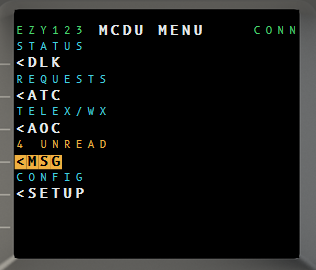
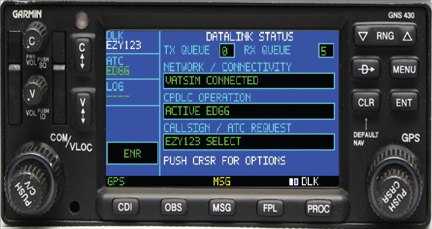
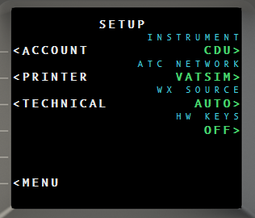
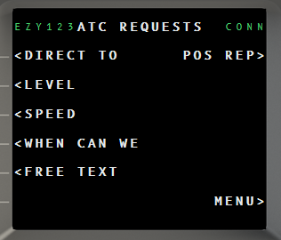
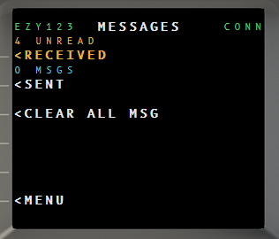
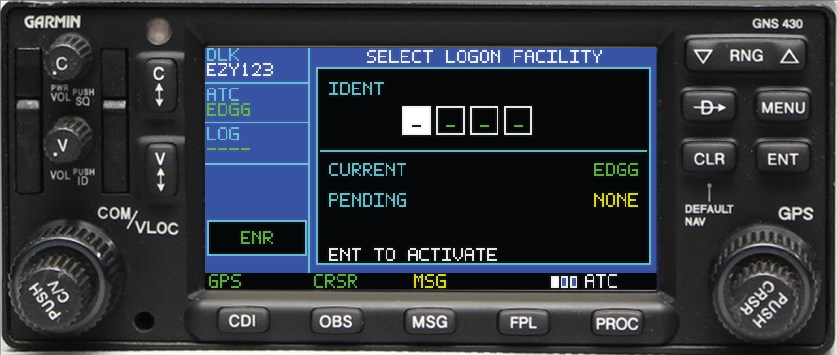
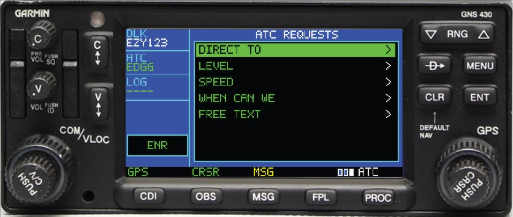
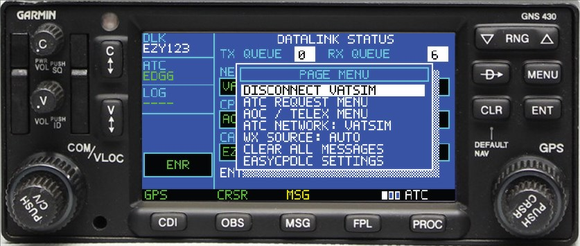

# EasyCPDLC-Loaded


**A hardware and software bridge for simulated datalink systems.**

Get ACARS/CPDLC off your main monitor and onto something you can actually touch.

| | |
|---|---|
|  |  |
| **Boeing 737 CDU** | **GNS430** |

---

## 📖 Guides

| | |
|---|---|
| **[1 · Installation](docs/1-INSTALLATION.md)** | Install the app, the MSFS WASM module, the vPilot bridge, and MobiFlight profiles |
| **[2 · CDU walkthrough](docs/2-CDU-GUIDE.md)** | Setup, every workflow, and the full CDU L-var / lamp reference |
| **[3 · GNS430 walkthrough](docs/3-GNS430-GUIDE.md)** | Setup, every workflow, and the full GNS430 command reference |

Also: **[Manual](docs/MANUAL.md)** (ships in the release) ·
**[Hardware guide](EasyCPDLC/VNS430/MSFS2024Module/README.md)** (MobiFlight + WASM detail)

---

## What it drives

- **WinWing CDU hardware** — the screen mirrors to a real MCDU/PFP through MobiFlight
  and its keys drive the app back. Captain, First Officer and Observer units are all
  supported, and the `MSG` / `CALL` / `FAIL` / `OFST` / `EXEC` lamps light on your
  hardware exactly when they light in software.
  **Set the unit to `OBSERVER`** — the 737 only has captain and first-officer CDUs, so
  the observer seat is never driven by the sim and cannot clash with the aircraft's own.
- **Any small screen** — a spare monitor, a USB display panel, a tablet. Run the
  instrument bare, with no bezel artwork, and it becomes a clean cockpit display.
- **A touchscreen** — every key and line-select is clickable, so a cheap touch panel
  becomes a working CDU with no other hardware at all.
- **A thermal printer** — clearances, ATIS and loadsheets as real paper strips.

None of it is required. The app works on its own with mouse and keyboard.

## Why it exists

So a pilot with CDU hardware can use **that hardware** to work the ACARS system, and
switch networks without relearning anything. The same physical unit talks to **VATSIM**
or **SayIntentions** — you change one setting, not your workflow. That includes the
datalink itself: on SI, PDC and CPDLC go to SayIntentions' ATSU (`PKGM`) over its
Hoppie-compatible ACARS network, with no VATSIM connection required — while Hoppie
stays polled in parallel so your VA's telex and loadsheets keep arriving.

It folds in **eLoadControl's** loadsheet generator, so a proper weight-and-balance
loadsheet is a few line-selects away and prints on the same strip as everything else,
instead of living in a browser tab on another screen.

And because it is a real Hoppie client, your **virtual airline's ACARS still works**:
VA TELEX messages and VA-issued loadsheets arrive in the same inbox, tagged
automatically however they reached you.

---

> ### ⚠️ Do not run the aircraft's own Hoppie connection
>
> If your aircraft has a built-in Hoppie/ACARS setup (PMDG, Fenix, iniBuilds, FSLabs,
> ToLiss…), set its network to **NONE** and clear its logon code before connecting.
>
> Hoppie delivers each message **once**, to whoever asks first. Two clients on the same
> callsign means messages are split unpredictably between them — some land in the
> aircraft, some here, and neither shows the full conversation.

---

## Quick start

1. Extract the release ZIP somewhere permanent and run **`EasyCPDLC.exe`**.
2. Tray icon → **Connection credentials…** → enter your **VATSIM CID** and
   **Hoppie logon code**.
3. On the CDU: `MENU` → `<DLK` → `<CONNECT`.

That's the whole install — the app is self-contained, with no runtime to install.
Full detail, including the optional bridges, is in
**[1 · Installation](docs/1-INSTALLATION.md)**.

---

## The instruments

Two front ends share one backend, one set of credentials, and one network/weather
configuration. Only one runs at a time — switch from the tray (**Instrument**) or on
the CDU (`SETUP` → **INSTRUMENT**).

### Boeing 737 CDU

A 24 × 14 character MCDU driven by twelve line-select keys and a full keypad. Anything
that transmits or destroys data is **armed first** and needs `EXEC` — no stray click
ever sends a message.

| Setup | Requests | Messages |
|---|---|---|
|  |  |  |

→ **[Full CDU walkthrough](docs/2-CDU-GUIDE.md)**

### GNS430

A knob-driven unit modelled on the Garmin GNS 430, with its bezel controls remapped to
the datalink. Cursor off navigates, cursor on interacts.

| Logon | Requests | Page menu |
|---|---|---|
|  |  |  |

→ **[Full GNS430 walkthrough](docs/3-GNS430-GUIDE.md)**

---

## Features

| | |
|---|---|
| **Networks** | VATSIM · SayIntentions (IVAO planned) |
| **Datalink** | Hoppie ACARS on VATSIM · SayIntentions ACARS (`PKGM`) on SI — CPDLC requests, clearances, logon, PDC, oceanic; Hoppie polled in parallel for VA traffic |
| **Weather** | VATSIM datalink, real-world METAR/TAF + D-ATIS, or SayIntentions |
| **Loadsheets** | eLoadControl generation, plus VA loadsheets over Hoppie — both auto-tagged |
| **Printing** | ESC/POS thermal, Windows queue, or mock-file preview |
| **Hardware** | WinWing CDU display mirroring, MobiFlight keys and annunciator lamps |
| **vPilot** | Optional bridge for vTDLS PDCs and Contact Me alerts |

---

## Requirements

- Windows 11 x64
- For VATSIM: a **VATSIM CID** and **Hoppie ACARS logon code**
- For SayIntentions: an **SI API key** and a filed **SimBrief** plan (Hoppie optional,
  for VA traffic)
- Optional: SimBrief, eLoadControl API key
- Optional: MSFS 2024 + MobiFlight for hardware
- Optional: a thermal receipt printer — see the
  [facade sizing warning](docs/1-INSTALLATION.md#troubleshooting) before buying a
  3D-printed shroud

---

## Security and privacy

- Credentials are stored **DPAPI-encrypted** for your Windows account and never
  written to logs.
- Never commit Hoppie codes, VATSIM credentials, or API keys. If a key was exposed,
  revoke it and issue a new one.
- Weather and loadsheet requests go directly to their services using your own keys.

---

## Build from source

```powershell
dotnet restore .\EasyCPDLC.sln
dotnet build .\EasyCPDLC.sln -c Release
dotnet test .\EasyCPDLC.Tests\EasyCPDLC.Tests.csproj -c Release
```

Package a release (produces the ZIP with both bridges and the manual):

```powershell
powershell -ExecutionPolicy Bypass -File .\scripts\Build-Release.ps1 -Version 1.1.0
```

---

## Credits, license, disclaimer

- This project: [Weebpummling/EasyCPDLC-Loaded](https://github.com/Weebpummling/EasyCPDLC-Loaded) (formerly `EasyCPDLC-Modernized-Printer-eLC`)
- Immediate upstream: [fresH229a/EasyCPDLC-Modernized](https://github.com/fresH229a/EasyCPDLC-Modernized)
- Original project: [quassbutreally/EasyCPDLC](https://github.com/quassbutreally/EasyCPDLC) — © 2022 Joshua Seagrave

The upstream README is preserved in [README.UPSTREAM.md](README.UPSTREAM.md).

Licensed under the **GNU General Public License v3.0 or later**, consistent with
upstream.

This unofficial community project is not affiliated with or endorsed by VATSIM,
SayIntentions, Hoppie, eLoadControl, SimBrief, PMDG, Garmin, MobiFlight, WinWing,
aircraft manufacturers, aviation authorities, or the original EasyCPDLC authors. It is
provided as-is, without warranty. Use it at your own risk.
