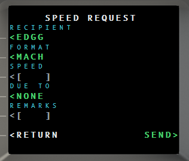
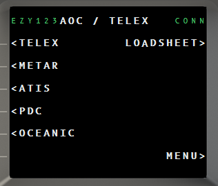
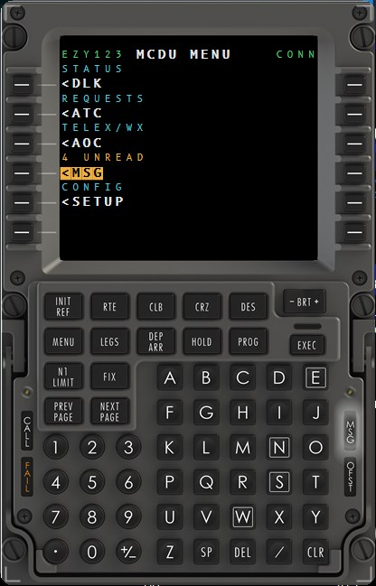

# 2 · Boeing 737 CDU walkthrough

The CDU is the default instrument: a 24 × 14 character MCDU driven by twelve
line-select keys, a full alphanumeric keypad, and the `EXEC` / `CLR` / `MENU` /
`PREV PAGE` / `NEXT PAGE` function keys.

Everything is clickable on screen, works from the keyboard, and can be driven by
physical hardware.

> New here? Do [1 · Installation](1-INSTALLATION.md) first.

---

## Contents

1. [The two rules](#the-two-rules)
2. [Menu map](#menu-map)
3. [Setup](#setup)
4. [Workflow: connect and log on](#workflow-connect-and-log-on)
5. [Workflow: send an ATC request](#workflow-send-an-atc-request)
6. [Workflow: read and answer messages](#workflow-read-and-answer-messages)
7. [Workflow: weather](#workflow-weather)
8. [Workflow: eLoadControl loadsheet](#workflow-eloadcontrol-loadsheet)
9. [Workflow: virtual-airline ACARS](#workflow-virtual-airline-acars)
10. [Printing](#printing)
11. [Hardware reference — L-vars](#hardware-reference--l-vars)

---

## The two rules

**Rule 1 — EXEC arms.** Anything that transmits on the network or destroys data is
*armed* first: the option highlights and the `EXEC` light comes on. Nothing happens
until you press **`EXEC`**. Navigation is immediate; only consequential actions arm.

This is your safety net — no stray click ever sends a message.

**Rule 2 — CLR steps back.** `CLR` cancels an armed action, then clears an error
message, then backspaces the scratchpad, in that order.

### Annunciators

| Lamp | Meaning |
|---|---|
| **MSG** | An inbound message is unread |
| **FAIL** | The CDU is showing an error — press `CLR` |
| **EXEC** | An action is armed and waiting for you |

---

## Menu map

Press `MENU` at any time to come back here.


```text
MENU
 ├─ <DLK      connection, ATC logon, print, reload flight plan
 ├─ <ATC      CPDLC requests
 ├─ <AOC      telex, weather, PDC, oceanic, loadsheet
 ├─ <MSG      inbox — RECEIVED / SENT / clear all
 └─ <SETUP    credentials, printer, network, weather, hardware
```

`<MSG` turns **amber with an unread count** when traffic is waiting. `<SETUP` turns
amber when a credential you need is missing.

---

## Setup

`MENU` → `<SETUP`


**Left column — sub-pages**

| Key | Page |
|---|---|
| `<ACCOUNT` | Credentials. Secrets show as `SET`, never the value |
| `<PRINTER` | Printer queue, mode, paper profile, cut, test print |
| `<TECHNICAL` | Full-screen dump of every stored value — the one place secrets are shown |
| `<WINWING` | Mirror this screen to a physical WinWing CDU |

**Right column — settings** (press the right-hand key to change)

| Setting | Values |
|---|---|
| **INSTRUMENT** | `CDU` ↔ `GNS430` — switches which unit is on screen |
| **ATC NETWORK** | `VATSIM` or `SI` (SayIntentions) |
| **WX SOURCE** | `AUTO` (follows the network) / `VATSIM` / `REAL WORLD` / `SAYINTENTIONS` |
| **HW KEYS** | `ON` lets a physical CDU drive the panel |

### Entering a value

Type it on the keypad — it appears in the **scratchpad** on the bottom line — then
press the line-select key next to the field. Press `CLR` to backspace.

---

## Workflow: connect and log on

**On VATSIM:**

1. `MENU` → `<DLK`
2. `<CONNECT` — the right column shows `VATSIM CONNECTED`
3. `<LOGON` — online CPDLC facilities are listed automatically; a tuned-frequency
   match shows in green
4. Select a facility (or type a 4-letter code and press `<LOGON`)
5. Press **`EXEC`** to transmit

**On SI (SayIntentions):** there is nothing to connect. With your SI API key and a
filed SimBrief plan in place, the datalink is live immediately — the `LOGON` page
offers **`PKGM`** (SayIntentions' always-on ATSU) as the first candidate, and PDC and
CPDLC route to the SayIntentions ACARS network automatically. Your callsign comes
from the SimBrief OFP, so file it before you request. Hoppie keeps being polled in
parallel: VA telex and loadsheets still arrive.

`<DLK` also has `<RELOAD FP` (re-fetch the SimBrief plan — this also clears the inbox
for the new leg, so it is EXEC-armed) and `<PRINT LAST` / `<REPRINT`.

---

## Workflow: send an ATC request

`MENU` → `<ATC`


| Request | What it sends |
|---|---|
| `<DIRECT TO` | Direct routing to a waypoint |
| `<LEVEL` | Climb/descend to a flight level |
| `<SPEED` | A Mach or knots restriction |
| `<WHEN CAN WE` | "When can we expect…" |
| `<FREE TEXT` | Free-text to the controller |
| `POS REP>` | A position report (no reply expected) |

Pick one and fill the form:



Fields with `[    ]` take typed input; fields like `DUE TO` cycle through fixed
options when you press their key. Then `SEND>` and press **`EXEC`**.

Sent requests appear under `<MSG` → `<SENT`.

---

## Workflow: read and answer messages

The **MSG** lamp lights and `<MSG` turns amber when something arrives.

`MENU` → `<MSG`


| Key | Does |
|---|---|
| `<RECEIVED` | Inbound messages — unread shown in amber |
| `<SENT` | What you have sent |
| `<CLEAR ALL MSG` | Wipes the inbox (destructive — EXEC-armed) |

Select a message to open it. Long messages (a loadsheet, a full clearance) scroll with
**`PREV PAGE` / `NEXT PAGE`** — the prompt appears bottom-right when there is more.

On a CPDLC message the available replies appear on the lower-left keys —
`<WILCO`, `<UNABLE`, `<STANDBY`, `<ROGER`, `<AFFIRM`, `<NEGATIVE` as appropriate.
Select one, then press **`EXEC`** to send.

`PRINT>` and `REPRINT>` are on the right.

---

## Workflow: weather

`MENU` → `<AOC`



- `<METAR` — enter an ICAO, send. Returns METAR + TAF.
- `<ATIS` — enter an ICAO, pick `ARRIVAL` / `DEPARTURE`, optionally `AUTO REFRESH`.

Where it comes from depends on **WX SOURCE** in `SETUP`:

| Source | METAR / TAF | ATIS | Needs a connection? |
|---|---|---|---|
| `VATSIM` | Hoppie `INFOREQ` | VATSIM D-ATIS | Yes |
| `REAL WORLD` | aviationweather.gov | Real D-ATIS | **No** |
| `SAYINTENTIONS` | SayIntentions `getWX` | SayIntentions ATIS + runways | **No** |

`AUTO` follows your ATC network. Real-world and SayIntentions weather arrive without a
datalink connection at all.

---

## Workflow: eLoadControl loadsheet

Set your **SimBrief user** and **eLoadControl API key** first (`SETUP` → `<ACCOUNT`).

1. `MENU` → `<AOC` → `LOADSHEET>`
2. The CDU pulls your SimBrief flight and the matching eLoadControl configurations
3. Cycle **aircraft variant**, **cabin configuration** and **output format**
4. Confirm the passenger split — single-class is prefilled, multi-class is editable
5. `GENERATE>` then press **`EXEC`**

> This consumes one eLoadControl API request.

The finished loadsheet arrives in `<RECEIVED` tagged **`LOADSHEET`**, scrolls with
`PREV/NEXT PAGE`, and prints with `PRINT>`.

---

## Workflow: virtual-airline ACARS

Nothing to configure. If your VA dispatches over Hoppie, its **TELEX messages and
loadsheets arrive in the same inbox** as everything else.

Anything that looks like a loadsheet — containing `LOADSHEET`, `LOAD PLANNING`,
`ELOADCONTROL`, or two or more weight tokens like `ZFW` / `TOW` / `LDW` — is
automatically tagged **`LOADSHEET`**, whether you generated it or your VA sent it.

Just be connected on the right callsign, with your aircraft's own Hoppie turned off.

---

## Printing

`SETUP` → `<PRINTER`: pick the Windows queue, the mode (**ESC/POS** for receipt
printers), the paper profile (`4 INCH` or `80MM`), cut mode and feed lines.

Run **`PRINT>` test** in **mock file** mode first — it writes a preview and hex dump
without using paper — then switch to ESC/POS for a real print.

Print the open message with `PRINT>`; `REPRINT>` repeats the last job. Inbound items
are review-first and never auto-print unless you enable auto-print by category.

---

## Hardware reference — L-vars

Every key below is a **momentary input**: set the variable to `1` on press. The bridge
handles the release. All require `SETUP` → **HW KEYS** = `ON`.



### Line-select keys

| Key | L-var | Key | L-var |
|---|---|---|---|
| L1 | `EASYCPDLC_DCDU_LSK_L1` | R1 | `EASYCPDLC_DCDU_LSK_R1` |
| L2 | `EASYCPDLC_DCDU_LSK_L2` | R2 | `EASYCPDLC_DCDU_LSK_R2` |
| L3 | `EASYCPDLC_DCDU_LSK_L3` | R3 | `EASYCPDLC_DCDU_LSK_R3` |
| L4 | `EASYCPDLC_DCDU_LSK_L4` | R4 | `EASYCPDLC_DCDU_LSK_R4` |
| L5 | `EASYCPDLC_DCDU_LSK_L5` | R5 | `EASYCPDLC_DCDU_LSK_R5` |
| L6 | `EASYCPDLC_DCDU_LSK_L6` | R6 | `EASYCPDLC_DCDU_LSK_R6` |

### Letters

`EASYCPDLC_CDU_A` … `EASYCPDLC_CDU_Z` — one per letter.

### Digits and symbols

| Key | L-var | Key | L-var |
|---|---|---|---|
| `0`–`9` | `EASYCPDLC_CDU_0` … `_9` | `SP` | `EASYCPDLC_CDU_SP` |
| `.` | `EASYCPDLC_CDU_DOT` | `DEL` | `EASYCPDLC_CDU_DEL` |
| `/` | `EASYCPDLC_CDU_SLASH` | `CLR` | `EASYCPDLC_CDU_CLR` |
| `+/−` | `EASYCPDLC_CDU_PLUSMINUS` | | |

### Function keys

| Key | L-var | Key | L-var |
|---|---|---|---|
| `EXEC` | `EASYCPDLC_CDU_EXEC` | `MENU` | `EASYCPDLC_CDU_MENU` |
| `PREV PAGE` | `EASYCPDLC_CDU_PREV_PAGE` | `NEXT PAGE` | `EASYCPDLC_CDU_NEXT_PAGE` |
| `INIT REF` | `EASYCPDLC_CDU_INIT_REF` | `RTE` | `EASYCPDLC_CDU_RTE` |
| `CLB` | `EASYCPDLC_CDU_CLB` | `CRZ` | `EASYCPDLC_CDU_CRZ` |
| `DES` | `EASYCPDLC_CDU_DES` | `LEGS` | `EASYCPDLC_CDU_LEGS` |
| `DEP ARR` | `EASYCPDLC_CDU_DEP_ARR` | `HOLD` | `EASYCPDLC_CDU_HOLD` |
| `PROG` | `EASYCPDLC_CDU_PROG` | `FIX` | `EASYCPDLC_CDU_FIX` |
| `N1 LIMIT` | `EASYCPDLC_CDU_N1_LIMIT` | `BRT +/−` | `EASYCPDLC_CDU_BRT_UP` / `_BRT_DN` |

> `INIT REF`, `RTE`, `CLB`, `CRZ`, `DES`, `LEGS`, `DEP ARR`, `HOLD`, `PROG`, `FIX`
> and `N1 LIMIT` exist as bindable inputs but are **inert** on this CDU — it is a
> datalink terminal, not an FMC. They are provided so a full 737 CDU can be wired up
> without gaps.

### Panel shortcuts

| Action | L-var |
|---|---|
| Connect / disconnect | `EASYCPDLC_DCDU_CONNECT` |
| Open ATC requests | `EASYCPDLC_DCDU_ATC` |
| Open AOC / telex | `EASYCPDLC_DCDU_AOC` |
| Open settings | `EASYCPDLC_DCDU_SETTINGS` |
| Reload flight plan | `EASYCPDLC_DCDU_RELOAD` |
| Print / reprint | `EASYCPDLC_DCDU_PRINT` / `_REPRINT` |
| Hide the window | `EASYCPDLC_DCDU_HIDE` |

### Outputs — annunciator lamps

Read these to drive LEDs. Each is `1` while lit, `0` otherwise. Use the RPN form
`(L:NAME, number) 0 >` in a MobiFlight output config.

| Lamp | L-var | Lights when |
|---|---|---|
| **MSG** | `EASYCPDLC_CDU_ANN_MSG` | An inbound message is unread |
| **FAIL** | `EASYCPDLC_CDU_ANN_FAIL` | The CDU is showing an error |
| **CALL** | `EASYCPDLC_CDU_ANN_CALL` | Reserved — lamp test only |
| **OFST** | `EASYCPDLC_CDU_ANN_OFST` | Reserved — lamp test only |
| **EXEC** | `EASYCPDLC_CDU_EXEC_LIGHT` | An action is armed, waiting for `EXEC` |

All five ship **pre-wired** in `EasyCPDLC-WinWing-737-CDU.mfproj` — you only need to
reassign the device. Test them with tray → **CDU tools → CDU annunciator lamp test**.

### Link status

| L-var | Meaning |
|---|---|
| `EASYCPDLC_VNS_MODULE_ALIVE` | Bridge loaded and ticking |
| `EASYCPDLC_VNS_APP_CONNECTED` | App running and paired |
| `EASYCPDLC_VNS_VATSIM_CONNECTED` | Datalink connected |
| `EASYCPDLC_VNS_UNREAD_COUNT` | Unread count (numeric — for a display) |
| `EASYCPDLC_DCDU_MODE` | Hardware keys are `ON` |

---

**Next:** [3 · GNS430 walkthrough](3-GNS430-GUIDE.md) ·
[Hardware guide](../EasyCPDLC/VNS430/MSFS2024Module/README.md)
