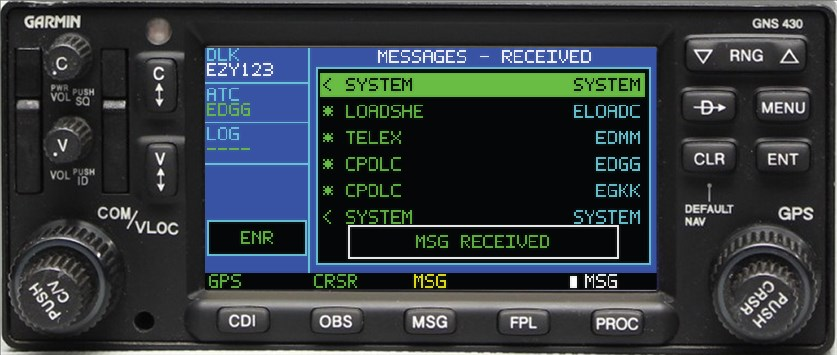
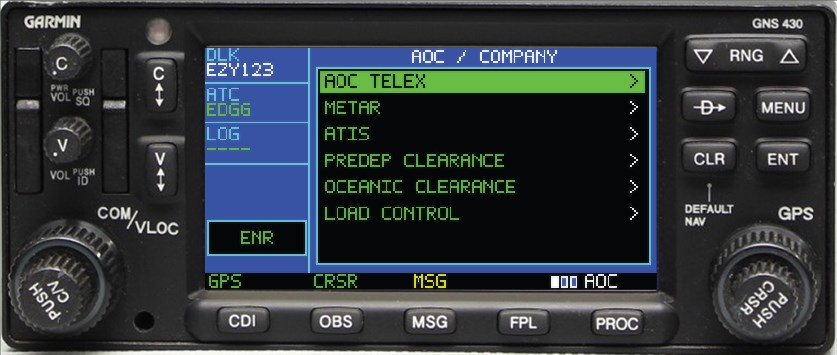

# 3 · GNS430 walkthrough

The GNS430 is the second instrument: a knob-driven unit modelled on the Garmin GNS 430,
with its bezel controls remapped to the datalink.

It shares everything with the CDU — same backend, same credentials, same network and
weather settings. Only the interaction style differs: **knobs and a cursor** instead of
line-select keys and a keypad.

> New here? Do [1 · Installation](1-INSTALLATION.md) first.
> Switch instruments from the tray → **Instrument → GNS430**, or on the CDU:
> `SETUP` → **INSTRUMENT**.


---

## Contents

1. [How the controls work](#how-the-controls-work)
2. [Page groups](#page-groups)
3. [Setup](#setup)
4. [Workflow: connect and log on](#workflow-connect-and-log-on)
5. [Workflow: ATC requests](#workflow-atc-requests)
6. [Workflow: messages](#workflow-messages)
7. [Workflow: weather and loadsheets](#workflow-weather-and-loadsheets)
8. [Screen-only mode](#screen-only-mode)
9. [Hardware reference — L-vars](#hardware-reference--l-vars)

---

## How the controls work

The GNS430 has no keypad. Everything is done with the **right-hand dual concentric
knob** and the bezel buttons.

| Control | With cursor **off** | With cursor **on** |
|---|---|---|
| **Large knob** | Change page *group* | Move the selection up/down |
| **Small knob** | Change page *within* the group | Edit the selected character or value |
| **Knob push** (`CRSR`) | Turn the cursor **on** | Turn it **off** |
| `ENT` | Activate the selection | Activate the selection |
| `CLR` | Go back | Clear the character, then exit the cursor |

The cursor is the core idea: **cursor off = navigate, cursor on = interact.** The
footer shows `CRSR` when it is active.

### Bezel buttons

| Button | Does |
|---|---|
| `MSG` | Open the inbox (unread first). Press again to cycle `ALL → RECEIVED → SENT` |
| `VLOC` | Open the full message log |
| `FPL` | ATC request menu |
| `PROC` | AOC / telex menu |
| `D→` | Logon page, prefilled with the best online facility |
| `CDI` | Connect / disconnect |
| `OBS` | Toggle the cursor (same as pushing the knob) |
| `MENU` | Page menu — config and actions |
| `RNG −` / `RNG +` | Smaller / larger LCD text |

---

## Page groups

Turn the **large knob** (cursor off) to move between groups; the **small knob** moves
within a group. The footer shows which group you are in.

| Group | Pages |
|---|---|
| **DLK** | Datalink status → Messages |
| **ATC** | Logon → **PDC** → ATC requests |
| **AOC** | AOC menu → Load control → Help |
| **MSG** | Messages |

---

## Setup

Press **`MENU`** for the page menu — this is where the shared settings live.


| Item | Does |
|---|---|
| `CONNECT / DISCONNECT VATSIM` | Toggles the datalink |
| `ATC REQUEST MENU` | Jumps to requests |
| `AOC / TELEX MENU` | Jumps to AOC |
| `ATC NETWORK: …` | Cycles `VATSIM` ↔ `SI` |
| `WX SOURCE: …` | Cycles `AUTO` / `VATSIM` / `REAL WORLD` / `SAYINTENTIONS` |
| `CLEAR ALL MESSAGES` | Wipes the inbox — **press twice** to confirm |
| `EASYCPDLC SETTINGS` | Opens the desktop settings window |
| `MSFS MODULE: …` | Toggles the hardware bridge |
| `INPUT HELP` | On-screen control reference |

Credentials themselves are entered from the tray (**Connection credentials…**) or the
CDU's `SETUP` → `<ACCOUNT` — they are shared between both instruments.

> `CLEAR ALL MESSAGES` requires a second press because there is no `EXEC` key on this
> unit. The item reads `CONFIRM CLEAR ALL?` while armed, and disarms if you leave.

---

## Workflow: connect and log on

1. Press **`CDI`** to connect (or `MENU` → `CONNECT VATSIM`)
2. Press **`D→`** for the logon page


3. The `IDENT` field is prefilled with the best online match. To change it: push
   **`CRSR`**, turn the **small knob** to set each character, **large knob** to move
   between them
4. Press **`ENT`** to send the logon

`CURRENT` shows the facility you are logged on to; `PENDING` shows a logon in flight.

---

## Workflow: ATC requests

Press **`FPL`**.


1. Turn the **large knob** to highlight a request type
2. Press **`ENT`** to open the form
3. For each field: **large knob** moves between fields, **small knob** changes the
   value or character
4. Press **`ENT`** to review, then **`ENT`** again to send

The review page shows the exact message text before it goes out — this is the
GNS430's equivalent of the CDU's `EXEC` arm.

---

## Workflow: messages

Press **`MSG`**. Press it again to cycle the filter: `ALL` → `RECEIVED` → `SENT`.



Each row shows a direction marker, the message type, and the station:

| Marker | Meaning |
|---|---|
| `*` | Unread inbound |
| `<` | Read inbound |
| `>` | Outbound (sent) |

Turn the **large knob** to select, press **`ENT`** to open. In a message, the large
knob scrolls the body. If the message has CPDLC replies available, a box appears at
the bottom — turn the **small knob** to pick `WILCO` / `UNABLE` / `STANDBY`, then
**`ENT`** to send.

The **MSG** annunciator in the footer lights amber while anything is unread.

> Loadsheets — whether you generated them or your VA sent them over Hoppie — show with
> type `LOADSHE` and are read exactly like any other message.

---

## Workflow: weather and loadsheets

Press **`PROC`** for the AOC menu.



| Item | Does |
|---|---|
| `AOC TELEX` | Free-text company message |
| `METAR` | Weather for a station |
| `ATIS` | ATIS for a station |
| `PREDEP CLEARANCE` | PDC request |
| `OCEANIC CLEARANCE` | Oceanic clearance request |
| `LOAD CONTROL` | eLoadControl loadsheet generation |

Select with the large knob, `ENT` to open, fill the fields with the knobs, then `ENT`
to review and send.

**Load control** walks the same path as the CDU: it pulls your SimBrief flight and
eLoadControl configurations, you pick aircraft / cabin / format and confirm the
passenger split, then generate. The finished loadsheet lands in the inbox.

Weather source follows `MENU` → `WX SOURCE`, exactly like the CDU.

### PDC

In the **ATC** group, turn the small knob to the **PDC** page. It shows the clearance
status, the issuing facility, and offers `REQUEST CLEARANCE` when one is available —
push `CRSR`, then `ENT`.

On **VATSIM**, availability follows the online controllers and their Hoppie
stations. On **SI** the facility is always SayIntentions' ATSU (shown as `SI`), and
the page shows `AVAIL` as soon as your SI API key and SimBrief plan are set — the
request is built from the SimBrief OFP, so no VATSIM connection is needed.

The **PDC VIA** item on the menu picks which side answers: `AUTO` follows ATC
NETWORK, `SI` or `VATSIM` forces one. SayIntentions hands flights off to VATSIM
controllers on their end, so pilots flying both at once can take the clearance
from either.

---

## Screen-only mode

With hardware driving the input, you usually want the LCD alone — no bezel artwork, no
click zones — so it can sit behind a physical unit.

```text
Tray icon → Display → Show panel artwork   (toggle off)
```

The panel becomes a bare letterboxed LCD. Mouse input is disabled in this mode by
design: drive it from hardware.

The window is borderless in both modes — drag it by the bezel (or the screen), resize
from any edge, and it remembers its size and position.

---

## Hardware reference — L-vars

The GNS430 uses a **single command variable**, not one variable per key. Write the
command number into `EASYCPDLC_VNS_COMMAND` and the bridge dispatches it.

```text
L:EASYCPDLC_VNS_COMMAND  =  <value from the table below>
```

This requires `MENU` → `MSFS MODULE` to be enabled, and `HW KEYS` **off** on the CDU
(the two input sets are mutually exclusive — `HW KEYS` on routes the hardware to the
CDU instead).


### Command values

| Value | Control | Action |
|---:|---|---|
| 1 | Large knob ← | Previous page group, or move selection up |
| 2 | Large knob → | Next page group, or move selection down |
| 3 | Small knob ← | Previous page in group, or decrement value |
| 4 | Small knob → | Next page in group, or increment value |
| 5 | Knob push | Toggle the cursor |
| 6 | `ENT` | Activate the selection |
| 7 | `CLR` | Back / clear |
| 8 | `MENU` | Page menu overlay |
| 9 | `MSG` | Messages, unread first / cycle filter |
| 10 | `FPL` | ATC request menu |
| 11 | `PROC` | AOC / telex menu |
| 12 | `D→` | Logon page |
| 13 | `OBS` | Toggle the cursor |
| 14 | `CDI` | Connect / disconnect |
| 15 | `RNG +` | Larger LCD text |
| 16 | `RNG −` | Smaller LCD text |
| 17 | `VLOC` | Full message log |
| 18 | Power | Show / hide the panel window |

Value **18** on a single key is handy — it brings the panel up and puts it away.

### No lamp outputs

**The GNS430 has no annunciator lamps to drive.** Unlike the CDU, this unit is
input-only — its indications (`MSG`, `CRSR`, page group, `ENR`) are drawn on the LCD
itself, so there is nothing to wire to an LED.

The general status variables are still readable if you want them on a separate display:

| L-var | Meaning |
|---|---|
| `EASYCPDLC_VNS_MODULE_ALIVE` | Bridge loaded and ticking |
| `EASYCPDLC_VNS_APP_CONNECTED` | App running and paired |
| `EASYCPDLC_VNS_VATSIM_CONNECTED` | Datalink connected |
| `EASYCPDLC_VNS_UNREAD_COUNT` | Unread count (numeric) |
| `EASYCPDLC_VNS_PAGE` | Current page index |
| `EASYCPDLC_VNS_CURSOR_ACTIVE` | Cursor is on |

### Profile

Import `EasyCPDLC-VNS430-Module.mfproj` from **`3 - MobiFlight Profiles`**. Every row
ships on a placeholder controller — reassign each to your own board and pins, and
leave the command column alone.

---

**Back:** [1 · Installation](1-INSTALLATION.md) · [2 · CDU walkthrough](2-CDU-GUIDE.md)
